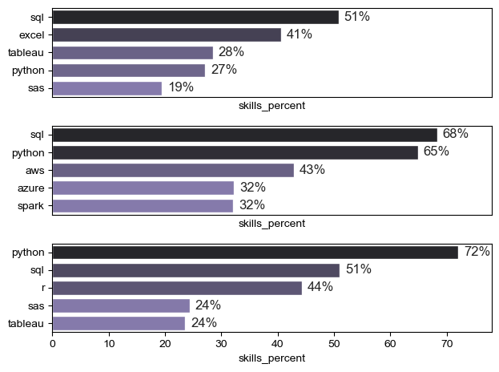
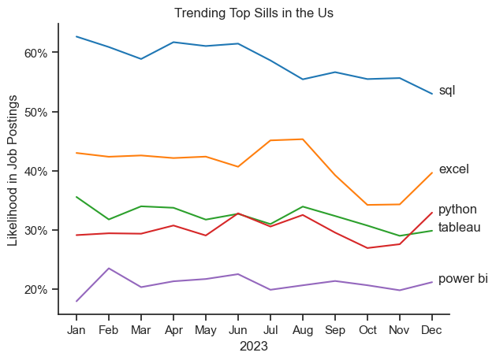
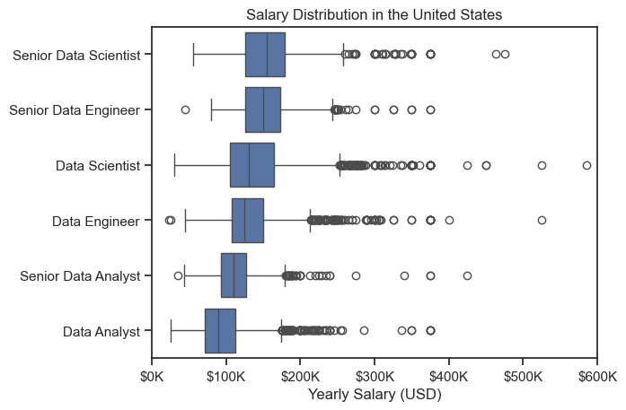
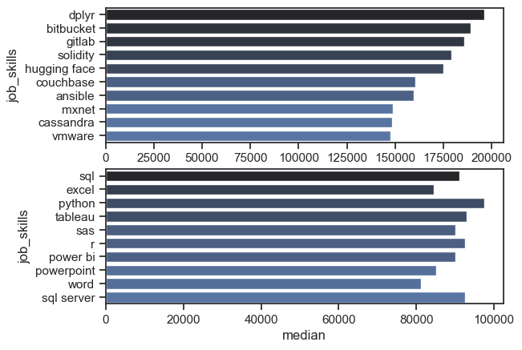

# Overview
Welcome to my analysis of the data analytics job market, focusing on data analyst roles. This project was created out of a desire to navigate and understand the job market more effectively. It delves into the top-paying and in-demand skills to help find optimal job opportunities for data analysts.

The data is sourced from Luke Barousse's Python Course on YouTube, which provides the foundation for my analysis. It contains detailed information on job titles, salaries, locations, and essential skills. Through a series of Python scripts, I explore key questions such as the most demanded skills, salary trends and the intersection of demand and salary in data analytics.

# The Questions
Below are the questions I want to answer in my project:

1. What are the skills most in demand for the top 3 most popular data roles?
2. How are in-demand skills trending for Data Analysts
3. How well do jobs and skills pay for Data Analysts?
4. What are the most optimal skills for Data Analysts to learn? (High Demand AND High Paying)

# Tools Used
For my analysis into the Data Analyst jobs market, I harnessed the power of several key tools:

- Python: Backbone of analysis, allowing me to analyze the data and find critical insights
    - Pandas Library
    - Matplotlib Library
    - Seaborn Library
- Jupyter Notebooks: tool used to write Python scripts
- Visual Studio Code: IDE used to store project and execute Python code

# The Analysis
## 1 What are the most demanded skills for the top 3 most popular data roles?
To find the most demanded skills for the top 3 most popular data roles, I filtered out those positions by which ones were the most popular, and acquired the top 5 skills for these top 3 roles. This script highlights the most popular job titles and their top skills, showing which skills I should pay attention to depending on my taget role.

View my notbook with detailed steps here: [2_Skill_Demand.ipynb](3_Project/2_skills_count.ipynb)

### Visualize Data
```python
fig,ax=plt.subplots(len(job_titles),1)
for i, job_title in enumerate(job_titles):
    df_plot=df_skills_perc[df_skills_perc['job_title_short']==job_title].head(5)
    # df_plot.plot(kind='barh',x='job_skills',y='skills_percent',ax=ax[i], title= job_title)
    sns.set_theme(style='ticks')
    sns.barplot(data=df_plot,x='skills_percent',y='job_skills',ax=ax[i],hue='skills_percent',palette='dark:m_r')
    ax[i].set_ylabel('')
    ax[i].legend().set_visible(False)
    ax[i].set_xlim(0,78)
    for n ,v in  enumerate(df_plot['skills_percent']):
        ax[i].text(v+1,n, f'{v:.0f}%', va='center')
    if i !=len(job_titles)-1:
          ax[i].set_xticks([])
    plt.tight_layout()
```

#### Results


### Insights
- Python is a versatile skill, highly demanded across all three roles, but most prominently for Data Scientists (72%) and Data Engineers (65%).
- SQL is the most requested skill for Data Analysts and Data Scientists, found in over half of the job postings.
- Data Engineers require more specialized technical skills (AWS, Azure, Spark) compared to Data Analysts and Data Scientists, who are expected to be proficient in more general data management and analysis tools (Excel, Tableau).
## 2. How are in-demand skills trending for Data Analysts?
### Visualize Data

```python
df_plot=df_DA_US_percent.iloc[:,:5]
sns.lineplot(data=df_plot,dashes=False,palette='tab10')
sns.set_theme(style='ticks')
sns.despine()
plt.title('Trending Top Sills in the Us')
plt.legend().remove()
plt.ylabel('Likelihood in Job Postings')
plt.xlabel('2023')
from matplotlib.ticker import PercentFormatter
ax=plt.gca()
ax.yaxis.set_major_formatter(PercentFormatter(decimals=0))
for i in range (5):
    plt.text(11.2,df_plot.iloc[-1,i],df_plot.columns[i])
```
#### Results


### Insights:
- SQL  remains the most consistently  demanded skill throught the year, although it shows a gradual decrease in demand
- Excel experienced a gradual increase in demand around september, surpassing both python and Tableau by the end of the year
- Both python and Tableau  show a relatively stable , some flucations but it remains essential skills for analysts
- PowerBi has the list demand

## 3 How well do jobs and skills pay for data analyst
### Salary Analysis for data nerds
### Visualize Data
```python
from matplotlib.ticker import FuncFormatter

sns.boxplot(df_Us_top_6, x='salary_year_avg', y='job_title_short',order=job_order)
sns.set_theme(style='ticks')

plt.title('Salary Distribution in the United States')
plt.xlabel('Yearly Salary (USD)')
plt.ylabel('')
plt.xlim(0, 600000)
ticks_x = plt.FuncFormatter(lambda y, pos: f'${int(y/1000)}K')
plt.gca().xaxis.set_major_formatter(ticks_x)
```
### Results


### Insights
- There is a significant variation in salary ranges across different job titles. - Senior Data Scientist positions tend to have the highest salary potential, reaching up to $600K, highlighting the high value placed on advanced data and mathematical skills, as well as industry experience.
- Senior Data Engineer and Senior Data Scientist roles exhibit a significant number of high-end salary outliers, suggesting that exceptional skills or circumstances can lead to substantial pay in these positions. In contrast, Data Analyst roles show more consistency in salary, with fewer outliers.
- The median salaries increase with the seniority and specialization of the roles. As responsibilities increase, there is a greater variance in compensation.


## Highest paid and most demanded skill
### Visulize Data
```python
fig,ax=plt.subplots(2,1)
sns.set_theme(style='ticks')
sns.barplot(data=df_DA_top_pay,x='median',y=df_DA_top_pay.index,ax=ax[0],hue='median',palette='dark:b_r')
ax[0].legend().remove()
# df_DA_Top_pay.plot(kind='barh',y='median',ax=ax[0])
# df_da_skills.plot(kind='barh',y='median',ax=ax[1])
sns.barplot(data=df_DA_skills,x='median',y=df_DA_skills.index,ax=ax[1],hue='count',palette='dark:b_r')
ax[1].legend().remove()
ax[0].set_xlim(ax[0].get_xlim())
```
### Results



### Insights
- Insights from the Top Bar Chart:

    High-Demand Skills with Higher Median Values:
    dplyr: This skill has the highest median value, indicating strong demand and possibly specialized expertise.
    bitbucket, gitlab, solidity: These skills are also highly valued, suggesting their importance in the current job market.
    hugging face, couchbase, ansible, mxnet, cassandra, vmware: These skills have substantial median values, indicating they are well-compensated and sought after in specific industries.
- Insights from the Bottom Bar Chart:

    Widely-Used Skills with Moderate Median Values:
    sql, excel, python: These are foundational skills widely used across many industries, reflected by their substantial but not top-tier median values.
    tableau, sas, r: These data analysis and visualization tools are valuable but command lower median values compared to the specialized skills in the top chart.
    power bi, powerpoint, word: General business and productivity tools have moderate median values, indicating steady demand but lower specialization.
    sql server: A specific tool related to SQL, showing demand but with a lower median value compared to broader skills.


 ## 4 What is the most Optimal Skill to Learn  as a Data Analyst
### Visualize data
```python
from adjustText import adjust_text
from matplotlib.ticker import PercentFormatter

# df_plot.plot(kind='scatter', x='skill_percent', y='median_salary')

sns.scatterplot(
    data=df_plot,
    x='skills_percent',
    y='median_salary',
    hue='technology'
)

sns.despine()
sns.set_theme(style='ticks')

texts = []
for i, txt in enumerate(df_da_high_skill_demand.index):
    texts.append(plt.text(df_da_high_skill_demand['skills_percent'].iloc[i], df_da_high_skill_demand['median_salary'].iloc[i], txt))

adjust_text(texts, arrowprops=dict(arrowstyle='->', color ='gray', lw=1))

# adjusting axis
ax = plt.gca()
ax.yaxis.set_major_formatter(plt.FuncFormatter(lambda y, pos: f'${int(y/1000)}K'))
ax.xaxis.set_major_formatter(PercentFormatter(decimals=0))

plt.xlabel('Percent of Data Analyst Jobs')
plt.ylabel('Median Yearly Salary ($USD)')
plt.title('Most Optimal Skills for Data Analysts in the US')

plt.tight_layout()
plt.show()
```
### Results


## Insights:
- High Demand, Lower Salary:
    Skills like SQL and Excel are in high demand but offer lower median salaries. This indicates these skills are fundamental and widely required, which may drive salaries down due to higher availability of skilled professionals.
- Moderate Demand, Higher Salary:
    Skills like Python and Oracle are in moderate demand but offer higher salaries, indicating a premium on these more specialized or advanced skills.
    Balanced Skills:
    Tableau and Power BI are both in moderate demand and offer competitive salaries, reflecting their importance in data visualization and business intelligence.
- Categorical Insights:

    - Programming:
    Python is the standout skill, offering high salaries, indicating strong demand for programming expertise in data analysis.
    - Analyst Tools:
    Tableau and Power BI are valued skills, suggesting that data visualization tools are crucial for data analysts.
    - Databases:
    SQL Server and Oracle command high salaries, highlighting the importance of database management skills.
    - Cloud:
    Go has a median salary of around $90K but is in lower demand, indicating niche expertise can be valuable.
    - Technology:
    General technology skills like SQL and Excel remain essential.